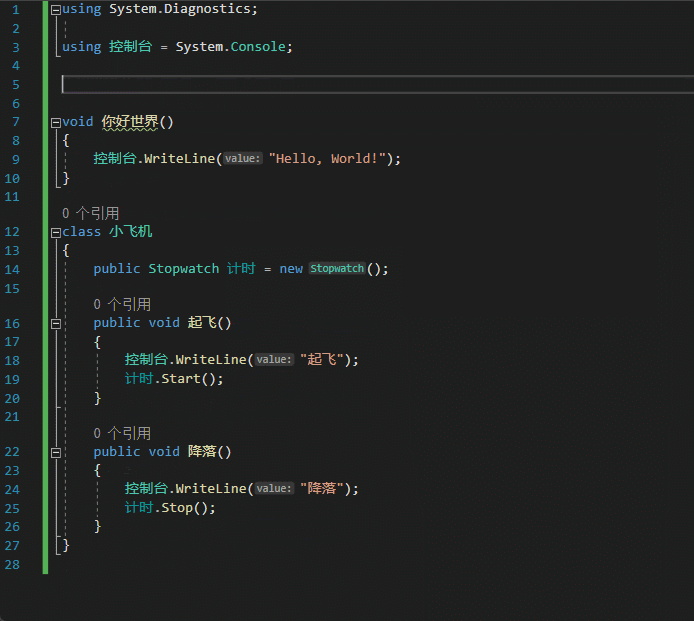
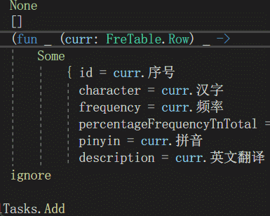
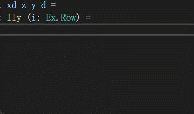
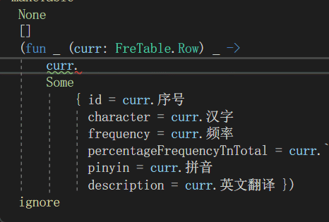
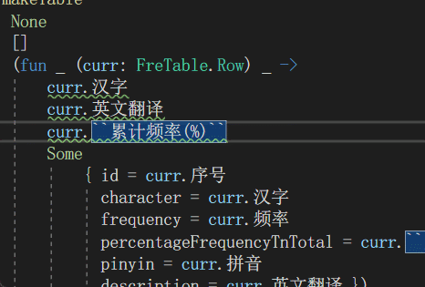
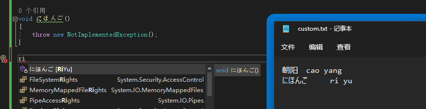

# ChinesePinyinIntelliSenseExtender

VisualStudio表意文字补全拓展(汉语拼音、五笔等)。

- 支持自定义字符映射，可支持任意表意文字的表音补全。

View at [VisualStudio Marketplace](https://marketplace.visualstudio.com/items?itemName=stratos.ChinesePinyinIntelliSenseExtender)

## 效果

内置的拼音字典支持多音字和繁体字：

可以切换成五笔：

或者其它自定义字典（如下图演示的[超强快码](https://github.com/whjiang/cqeb)）：

自定义字符串映射：

## 自定义字典

### * 现在支持直接使用 rime 输入方案的词典文件，自定义字典参照 rime 输入方案的字典文件 ([拼音](https://github.com/rime/rime-pinyin-simp/blob/master/pinyin_simp.dict.yaml)、[五笔](https://github.com/KyleBing/rime-wubi86-jidian/blob/master/wubi86_jidian.dict.yaml)) 来创建

---------------------

## 引用

内置的字典来源于下列输入方案的词典：

`./src/Assets/Dictionaries/pinyin_simp.dict.yaml` - [Rime/rime-pinyin-simp 袖珍简化字拼音](https://github.com/rime/rime-pinyin-simp)（[Apache-2.0 协议](https://github.com/rime/rime-pinyin-simp/blob/master/LICENSE)）

`./src/Assets/Dictionaries/wubi86_jidian.dict.yaml` - [KyleBing/rime-wubi86-jidian 86五笔极点码表 for 鼠须管(macOS)、小狼毫(Windows)、中州韵(Linux:Ubuntu) 五笔输入法](https://github.com/KyleBing/rime-wubi86-jidian)（[Apache-2.0 协议](https://github.com/KyleBing/rime-wubi86-jidian/blob/master/LICENSE)）

`./src/Assets/Dictionaries/jap_poly.dict.yaml` - [poly日文](https://github.com/biopolyhedron/rime-jap-poly)

## 其他平台类似插件

* [Jetbrains/IntelliJ](https://github.com/tuchg/ChinesePinyin-CodeCompletionHelper)
* [VSCode](https://gitee.com/Program-in-Chinese/vscode_Chinese_Input_Assistant)
